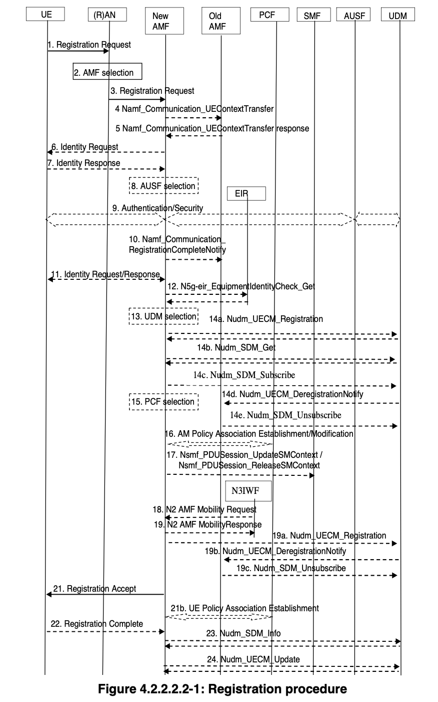

# free5gc-fsm-sample

This repository aims to understand how free5gc works

According to following diagram ...

When receiving NAS message from RAN, AMF on free5gc needs to handle proper procedures

I wish it will be useful for understanding it

## How to Run

You can confirm how FSM works as following

    % go run main.go
    ... Send Event: [GmmMessageEvent], after receiving [NAS-PDU: Registration request]
    Receiving Event: [Gmm Message] on DeRegistered
    ... Send Event: StartAuthEvent
    Receiving Event: [Exit event] on DeRegistered
    Receiving Event: [Start Authentication] on DeRegistered
    Receiving Event: [Entry event] on Authentication
    (Receiving Event: AuthRestartEvent on Authentication)

    ... Send Event: [GmmMessageEvent], after receiving [NAS-PDU: Authentication Response]
    Receiving Event: [Gmm Message] on Authentication
    ... Send Event: AuthSuccessEvent
    Receiving Event: [Exit event] on Authentication
    Receiving Event: [Authentication Success] on Authentication
    Receiving Event: [Entry event] on SecurityMode

    ... Send Event: [GmmMessageEvent], after receiving [NAS-PDU: Security mode complete]
    Receiving Event: [Gmm Message] on SecurityMode
    ... Send Event: SecurityModeSuccessEvent
    Receiving Event: [Exit event] on SecurityMode
    Receiving Event: [SecurityMode Success] on SecurityMode
    Receiving Event: [Entry event] on ContextSetup

    ... Send Event: [GmmMessageEvent], after receiving [NAS-PDU: Registration complete]
    Receiving Event: [Gmm Message] on ContextSetup
    ... Send Event: ContextSetupSuccessEvent
    Receiving Event: [Exit event] on ContextSetup
    Receiving Event: [ContextSetup Success] on ContextSetup
    Receiving Event: [Entry event] on Registered
